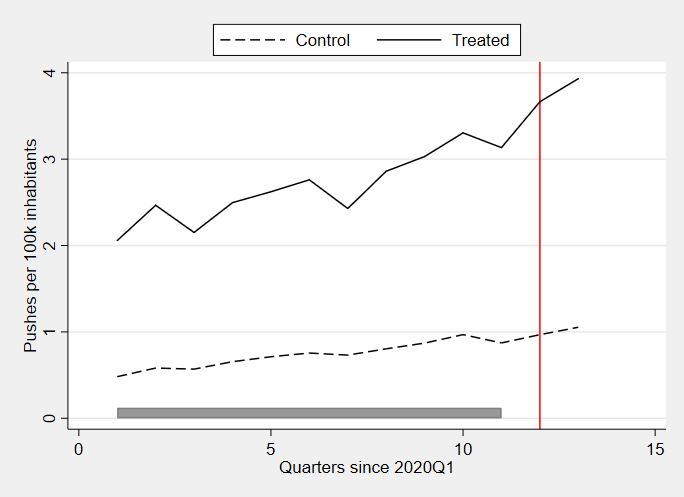
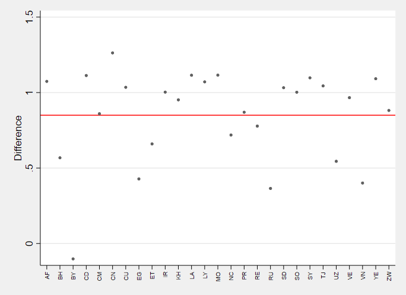
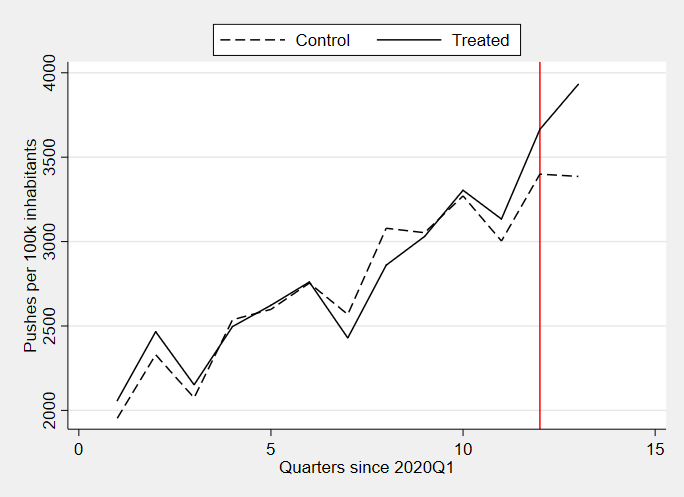
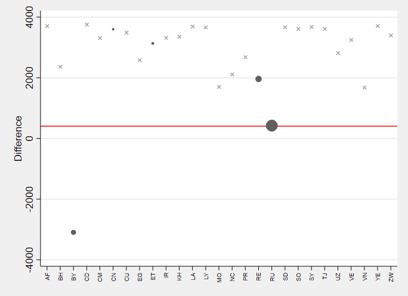
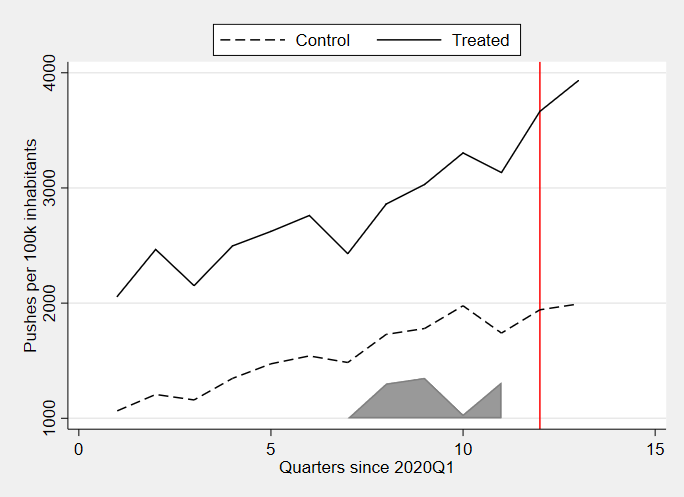
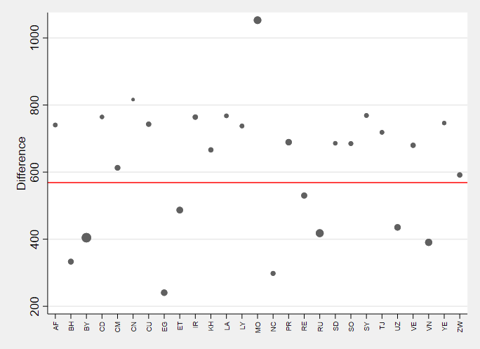

## #. Results

**Table #** summarizes the results after estimating the ATE with the previously described methods. 

|      | Coef.    | s.e.   | z    | P<\|z\| | 95% C.I.          |
|------|----------|--------|------|---------|-------------------|
| DiD  | 849.9*** | 139.06 | 6.11 | 0.00    | [577.34, 1122.45] |
| SC   | 405.92   | 501.68 | 0.81 | 0.42    | [-578, 1390]      |
| SDiD | 568.7*** | 138.69 | 4.1  | 0.00    | [296.88 , 840.52] |

